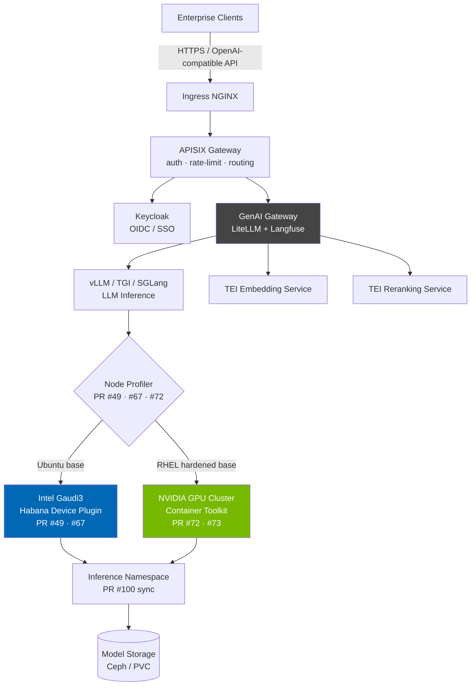

# OPEA Enterprise Inference — Engineering Contributions

This fork tracks my upstream infrastructure and platform engineering contributions to **[Intel® AI for Enterprise Inference](https://github.com/opea-project/Enterprise-Inference)**, an open-source solution built on the **OPEA (Open Platform for Enterprise AI)** framework.

The project automates the deployment and lifecycle management of LLM inference services on Intel Xeon and Intel Gaudi hardware using Kubernetes, Ansible, and Helm.

---

## Industry Recognition

My deployment automation code has been adopted and cited by **Dell Technologies** in an official enterprise reference architecture:

> [Dell InfoHub: Bare-Metal Ubuntu Automation for Enterprise Inference (CPU/Gaudi3)](https://infohub.delltechnologies.com/en-us/p/bare-metal-ubuntu-automation-for-enterprise-inference-cpu-gaudi3/)

> **Corporate Attribution Note:** My upstream contributions were developed and merged via a corporate GitHub account. This document provides the direct public PR links and full engineering context for architectural reviewers.

---

## System Architecture



---

## Deployment Stack

| Layer | Technology |
|---|---|
| Orchestration | Kubernetes (bare-metal, RKE2) / OpenShift |
| Automation | Ansible playbooks + Helm charts |
| Inference engines | vLLM, TGI (text-generation-inference), SGLang |
| Embedding / Reranking | TEI (text-embeddings-inference) |
| API gateway | APISIX |
| Identity | Keycloak (OIDC) |
| LLM observability | GenAI Gateway (LiteLLM + Langfuse) |
| Cluster observability | Prometheus + Grafana + Fluentbit |
| Storage | Ceph (distributed), local PVCs |
| Hardware | Intel Gaudi 3, Intel Xeon Scalable, NVIDIA GPU |

---

## Merged Pull Requests

My core focus was stabilizing distributed, multi-tenant LLM inference workloads across heterogeneous compute (Intel Gaudi3 and NVIDIA GPUs) in air-gapped enterprise environments.

### [PR #49 — Script Modification for Clean Environment Target Bootstrapping](https://github.com/opea-project/Enterprise-Inference/pull/49)

- **Technical Focus:** OS environment initialization and execution layer isolation
- **Problem:** Bootstrap scripts suffered from path conflicts and environment variable bleeding across target nodes, causing unstable initialization of the inference substrate.
- **Solution:** Restructured script execution flags and setup parameters to isolate system-level dependencies. Added strict host readiness validation before any downstream steps run.
- **Impact:** Eliminated initialization failures across deployment nodes, producing a drift-free substrate for the AI runtime.

---

### [PR #67 — Ubuntu OS Installation/Deployment Script](https://github.com/opea-project/Enterprise-Inference/pull/67)

- **Technical Focus:** Full-lifecycle Ubuntu deployment automation and idempotent shell scripting
- **Problem:** Manual host preparation introduced inconsistent directory permissions, path errors, and brittle orchestration dependencies across Ubuntu nodes.
- **Solution:** Built an idempotent end-to-end automation script covering directory provisioning, system configuration, and environment path definitions — producing a repeatable, immutable installation sequence.
- **Impact:** Eliminated manual runbook execution and reduced node onboarding time. This script is the automation foundation cited in the Dell Technologies whitepaper.

---

### [PR #72 — RHEL Deployment Adaptations and Hardening](https://github.com/opea-project/Enterprise-Inference/pull/72)

- **Technical Focus:** RHEL platform engineering, enterprise filesystem compliance, SELinux compatibility
- **Problem:** Deploying into RHEL environments failed due to non-standard installation paths, SELinux constraints, and enterprise filesystem policies incompatible with the existing scripts.
- **Solution:** Overhauled the deployment script to adapt to RHEL directory layouts and security baselines. Added explicit path validation, error-handling routines, and file permission schemes compliant with enterprise security policy.
- **Impact:** Unlocked RHEL and OpenShift environments — organizations running zero-trust, SELinux-enforced infrastructure can now deploy OPEA runtimes without modifying their security posture.

---

### [PR #73 — NVIDIA Configuration Support and Device Runtime Orchestration](https://github.com/opea-project/Enterprise-Inference/pull/73)

- **Technical Focus:** Heterogeneous accelerator orchestration, NVIDIA container runtime mapping, hardware abstraction
- **Problem:** The deployment framework had no clean mechanism to switch between Intel Gaudi and NVIDIA GPU targets, leading to container runtime failures and device plugin conflicts.
- **Solution:** Added conditional configuration logic that detects the host hardware platform at deploy time, injects the correct NVIDIA container toolkit hooks, maps device plugins, and mounts required execution directories — without manual intervention.
- **Impact:** True multi-hardware support from a single deployment pipeline. Operations teams can target Gaudi3 or NVIDIA clusters using identical automation.

---

### [PR #100 — Microservice Dependency Synchronization and Race Condition Resolution](https://github.com/opea-project/Enterprise-Inference/pull/100)

- **Technical Focus:** Container lifecycle coordination, microservice health checking, distributed system startup stability
- **Problem:** Cold-start pod restart loops occurred because downstream services attempted connections before core platform services were healthy — a distributed system initialization race condition.
- **Solution:** Introduced deterministic startup synchronization: progressive health-check wait loops ensuring core services reach `Ready` state before subordinate microservices start.
- **Impact:** Eliminated initialization race conditions during cluster scale-up events, directly improving uptime SLAs for production inference clusters.

---

## Infrastructure Patterns

### Heterogeneous Accelerator Scheduling

```yaml
apiVersion: apps/v1
kind: Deployment
metadata:
  name: opea-core-inference-engine
  namespace: enterprise-ai-workloads
spec:
  replicas: 3
  strategy:
    type: RollingUpdate
    rollingUpdate:
      maxSurge: 1
      maxUnavailable: 0
  template:
    spec:
      containers:
      - name: opea-llm-runtime
        image: opea/enterprise-inference-engine:latest
        securityContext:
          readOnlyRootFilesystem: true
          allowPrivilegeEscalation: false
          runAsNonRoot: true
          runAsUser: 10001
        resources:
          limits:
            memory: "64Gi"
            cpu: "16"
            habana.ai/gaudi: "1"       # Intel Gaudi — toggled via PR #49/#67
            # nvidia.com/gpu: "1"      # NVIDIA — injected via PR #73 RHEL config
          requests:
            memory: "32Gi"
            cpu: "8"
        volumeMounts:
        - name: model-cache
          mountPath: /data/models
          readOnly: true
      volumes:
      - name: model-cache
        persistentVolumeClaim:
          claimName: opea-model-mesh-pvc
```

### Host OS Automation (Ansible)

```yaml
- name: Standardize Enterprise Host Infrastructure
  hosts: ai_accelerator_nodes
  become: true
  tasks:
    - name: Validate host kernel architecture
      ansible.builtin.assert:
        that:
          - ansible_distribution in ['Ubuntu', 'RedHat']
          - ansible_architecture == 'x86_64'
        fail_msg: "Host OS does not match validated OPEA deployment matrix."

    - name: Enforce kernel memory mapping limits
      ansible.builtin.sysctl:
        name: vm.max_map_count
        value: '262144'
        state: present
        reload: true

    - name: Ensure container runtime is active
      ansible.builtin.systemd:
        name: containerd
        state: started
        enabled: true
```

---

## Deployment

```bash
# 1. Define cluster topology
vim inventory/hosts.yaml

# 2. Configure components (hardware, models, auth)
vim inference-config.cfg

# 3. Deploy the full stack
bash inference-stack-deploy.sh
```

**Ansible playbook execution sequence:**

| Playbook | Purpose |
|---|---|
| `inference-precheck.yml` | Validate hosts and prerequisites |
| `deploy-cluster-config.yml` | Kubernetes cluster baseline |
| `deploy-habana-ai-operator.yml` | Intel Gaudi device plugin (Gaudi targets only) |
| `deploy-ingress-controller.yml` | NGINX ingress |
| `deploy-keycloak-*.yml` | Keycloak identity provider |
| `deploy-observability.yml` | Prometheus + Grafana |
| `deploy-inference-models.yml` | vLLM / TGI / SGLang model pods |
| `deploy-genai-gateway.yml` | LiteLLM + Langfuse gateway |

**Supported topologies:**

| Topology | Use case |
|---|---|
| Single node — vLLM Docker | Quick local testing |
| Single node — full stack | Dev / lightweight workloads |
| Single master + N workers | Higher throughput |
| Multi-master + N workers | HA production clusters |
| Brownfield | Deploy onto an existing Kubernetes cluster |

---

## Sample Solutions

Pre-built OPEA application blueprints included in the repo:

| Blueprint | Description |
|---|---|
| `RAGChatbot` | Retrieval-augmented generation with TEI embeddings and reranking |
| `DocSummarization` | Document summarization pipeline |
| `MultiAgentQnA` | Multi-agent question answering |
| `HybridSearch` | Dense + sparse search hybrid |
| `PDFToPodcast` | PDF ingestion to audio |
| `agenticai` | Agentic AI workflow samples |

---

All linked PRs are public at [github.com/opea-project/Enterprise-Inference](https://github.com/opea-project/Enterprise-Inference).